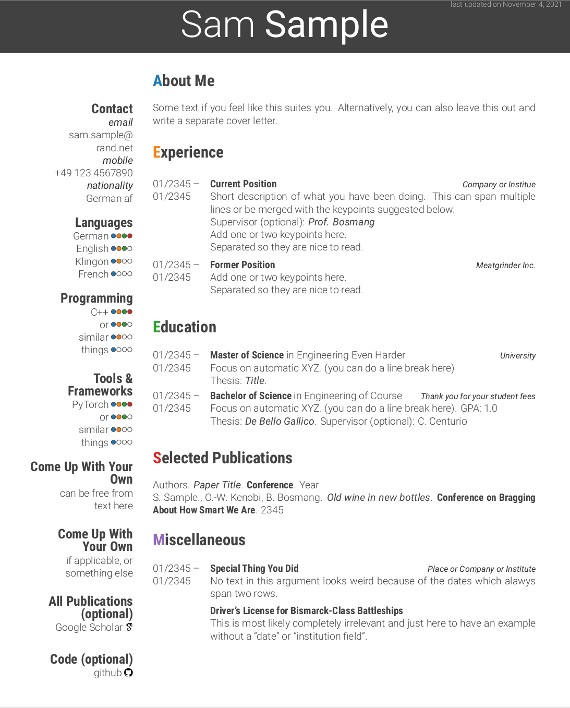

# Dolche Curriculum Vitae
A LaTeX-based, yet nice, template for your curriculum vita based on [Friggeri CV template](https://www.overleaf.com/latex/templates/friggeri-cv-template/hmnchbfmjgqh) which is iteself based on the [Awesome-CV](https://github.com/posquit0/Awesome-CV).
I added some commands, simplified things, switched the font, changed colors, and adapted the layout.
So, feel free to modify according to your needs, e.g. add and remove categories.

Check out the demo.

# Suggestions / Adivces
- Try to keep it all on one page, especially if you are a bachelor, master or PhD student. Nobody has the time to read everything you want to say. Moreover, if your CV says it all, you are making it less likely that they will ask questions that you can easily answer. 
- Think about what is relevant for the position you are applying to, and exand the parts that fit while reducing the parts that to no matter (for this position).
- Please don't be the person that adds travel grants to awards, that's just embarssing.
- Don't forget to enter your name and ID for accounts like Google Scholar or GitHub.

# Trivia
Yes, the color are familiar to you. It's the "tab10" color palette from seaborn.
